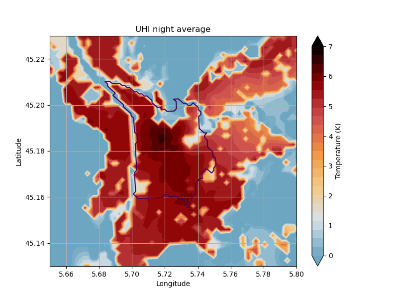

# UHI Analysis Report

This report presents the results from the control simulation of the heatwave of August 2023. The analysis includes temperature time series, average UHI maps, and UHI maps overlaid with wind fields for each night and day period within the specified date range.

## Temperature Time Series with Night Shading

The following plot shows the temperature time series for the city centre and Le Versoud, with shaded regions indicating night periods.

## UHI Average

### Day Average

The following image shows the average UHI during the day periods over the simulation period.

### Night Average

The following image shows the average UHI during the night periods over the simulation period.

## UHI Maps

The following sections present UHI maps for each night and day period during the simulation.

### UHI for Each Night Period

#### 2023-08-17 to 2023-08-18

#### 2023-08-18 to 2023-08-19

#### 2023-08-19 to 2023-08-20

#### 2023-08-20 to 2023-08-21

#### 2023-08-21 to 2023-08-22

#### 2023-08-22 to 2023-08-23

#### 2023-08-23 to 2023-08-24

### UHI for Each Day Period

#### 2023-08-18

#### 2023-08-19

#### 2023-08-20

#### 2023-08-21

#### 2023-08-22

#### 2023-08-23

## UHI with Wind Overlay

The following sections present UHI maps with wind fields overlaid for each night and day period during the simulation.

### UHI with Wind for Each Night Period

#### 2023-08-17 to 2023-08-18

#### 2023-08-18 to 2023-08-19

#### 2023-08-19 to 2023-08-20

#### 2023-08-20 to 2023-08-21

#### 2023-08-21 to 2023-08-22

#### 2023-08-22 to 2023-08-23

#### 2023-08-23 to 2023-08-24

### UHI with Wind for Each Day Period

#### 2023-08-18

#### 2023-08-19

#### 2023-08-20

#### 2023-08-21

#### 2023-08-22

#### 2023-08-23

#### 2023-08-24

