# Heatwave Detection: Methods and Metrics

#### Jacobo Gabeiras Penas

## Introduction

A heatwave (HW) is a period of extremely high temperature that can have significant impacts on various sectors such as human health, electricity supply, transportation, and agriculture (Perkins et al. 2013; Perkins 2015). Given the varying impacts across different sectors, a universal definition of a heatwave is challenging. In this work, we focus on the impacts of heatwaves on human health and mortality. Research indicates that health effects are most severe when there is a lack of relief between hot days (Pezza et al. 2012), necessitating definitions of heatwaves that include both maximum and minimum temperature thresholds. This document explores the traditional 92nd percentile method and introduces the Excess Heat Factor (EHF) method as an alternative approach to heatwave detection. While both methods are based on their ability to capture significant temperature anomalies that correlate with increased mortality rates (Pascal et al. 2006).

## 92nd Percentile Method

#### Definition

One method for detecting heatwaves, particularly those impacting human health, involves using percentile-based thresholds for both maximum and minimum temperatures. This method is advantageous as it accounts for variations in climate across different locations and time periods.

In this case, a heatwave is defined as a period of at least 3 consecutive days where both the maximum (Tmax) and minimum (Tmin) temperatures are above or equal to the respective 92nd percentile for the historical months of May through October (MJJASO). This approach aligns with widely used definitions in literature (Perkins et al. 2013; Antics et al. 2013; Cowan et al. 2014; Russo et al. 2015). The choice of the 92nd percentile is based on its ability to capture significant temperature anomalies that correlate with increased mortality rates (Pascal et al. 2006).

#### Advantages

- **Location-specific:** The percentile-based approach adapts to different climates, making it suitable for diverse geographic locations.
- **Time-specific:** By considering historical data, this method adjusts for seasonal variations.
- **Tangible Metric:** The 92nd percentile method is an understandable clear and simple metric.

#### Limitations

- **Potential Misses:** This method might miss some heatwaves if the temperature goes slightly below the threshold, even when there is clearly a heatwave.
- **Static thresholds:** The use of fixed percentiles may not account for changing climate conditions over time.
- **Modulability:** The 92nd percentile method is a clear and simple metric, but it is not very tweakable to adjust for different conditions.
- **Short-term high intensity focus:** This method primarily captures short-term heat events and may not fully reflect cumulative stress from prolonged heat periods.

## Excess Heat Factor Method (EHF)

#### Introduction

The Excess Heat Factor (EHF) is a metric developed to better quantify the intensity and potential impact of heatwaves (Nairn & Fawcett, 2016). This method considers both the short-term and long-term temperature anomalies, providing a more comprehensive assessment of heat stress. The EHF method provides a single metric for heatwave severity, which can be extrapolated for spatial analysis and directly related to the potential risk of fatalities.

#### Methodology

The EHF metric is calculated using three components:
1. **Excess Heat Index (EHI) short-term (EHISIG):** Measures the deviation of the three-day mean temperature from the 95th percentile of the historical temperature for that period.
2. **Excess Heat Index (EHI) long-term (EHIACC):** Measures the deviation of the three-day mean temperature from the mean temperature of the previous 30 days.
3. **EHF:** Combines the EHISIG and EHIACC to provide a metric that reflects both immediate and cumulative heat stress.

EHISIG Formula
\[ \text{EHISIG}(i) = \max\left(\frac{T_{M,i} + T_{M,i-1} + T_{M,i-2}}{3} - T_{95}, 0\right) \]
A positive EHISIG indicates an unusually warm three-day period relative to the local climate statistics, while all other days are assigned a value of zero.

EHIACC Formula
\[ \text{EHIACC}(i) = \frac{T_{M,i} + T_{M,i-1} + T_{M,i-2}}{3} - \frac{\sum_{k=3}^{32} T_{M,(i-k)}}{30} \]
A positive value of EHIACC indicates a sharp temperature rise, to which the local population might not have time to acclimatize.

EHF Formula
\[ \text{EHF}(i) = \text{EHISIG}(i) \times \max(1, \text{EHIACC}(i)) \]

Authors of the EHF method propose filtering out non-severe days by taking only the days whose excess heat factor exceeds the 85th percentile of all positive values during the climatological period. This approach improves the accuracy of detecting significant heatwaves and discarding non-severe events.

For each detected event, the daily EHF values are summed to obtain the Integrated Excess Heat Factor (IEHF), which represents the total heat load of the event. The maximum daily EHF value (maxEHF) during the event is also recorded. These metrics (IEHF and maxEHF) have been found to correlate with the severity of heatwaves and their impacts.

#### Advantages

- **Comprehensive:** By incorporating both short-term and long-term temperature anomalies, the EHF provides a more comprehensive measure of heat stress. EHF accounts for the overall heat load and lack of relief, making it a comprehensive metric for assessing heatwave impacts.
- **Single Metric:** The EHF provides a single number for heatwave severity, simplifying the analysis and communication of heatwave risk.
- **Spatial Analysis:** The EHF can be extrapolated for spatial analysis, allowing for a more detailed and region-specific understanding of heatwave impacts.
- **Predictive power:** Studies have shown that the EHF correlates well with heat-related fatalities, making it a valuable tool for public health planning (Nairn & Fawcett, 2016).
- **Adaptability:** The EHF method has a set of parameters that can be adapted for the climatic conditions of the region, allowing for filtering and adjustment.

#### Limitations

- **Complexity:** The calculation of EHF is more complex compared to the percentile-based method.
- **Differentiation:** EHF does not differentiate between Tmin and Tmax heatwaves, which have different impacts. However, this can be seen as an advantage since it accounts for the average heat load and lack of relief.

#### Severity Classification

The EHF method can be used to classify heatwave severity into categories based on IEHF and maxEHF values. For each category, the equivalent (Nairn & Fawcett 2015) severity class is also reported for comparison based on the threshold EHF values for Melbourne and Adelaide. The table below shows the proposed classification regarding the place of study:

| Category | EHFsum | EHFmax | Mean number of fatalities | Percentage of record covered | Equivalent NF15 class for Melbourne | Equivalent NF15 class for Adelaide |
|----------|--------|--------|---------------------------|------------------------------|-------------------------------------|-------------------------------------|
| CAT0     | > 0    | > 0    | 5                         | 82.6                         | low-intensity                       | low-intensity                       |
| CAT1     | > 30   | > 15   | 6.7                       | 55.4                         | low-intensity                       | low-intensity                       |
| CAT2     | > 80   | > 30   | 8.6                       | 38.9                         | severe                              | low-intensity                       |
| CAT3     | > 150  | > 50   | 10.4                      | 28.6                         | severe                              | severe                              |
| CAT4     | > 300  | > 70   | 18.5                      | 12                           | extreme                             | severe                              |

The Integrated Excess Heat Factor (IEHF) and the maximum daily EHF value (maxEHF) are expressed in units of K squared and represent the total heat load and the peak intensity of the heatwave, respectively. It is important to note that the relationship of this metric with the severity might depend on the place. It provides however a rough estimate of the relative severity which allows for temporal as well as spatial analysis.  

## Application of both methods

Here we implement these two methods on the historical data of the weahter station of the airport of Grenoble. The reason this station is chosen is because it is close to Grenoble and has a large temporal coverage. For both methods we set the climatological reference period on 1985-2014 while the total coverage is 1970-2024 for the purpose of later comparison with historical model data. 

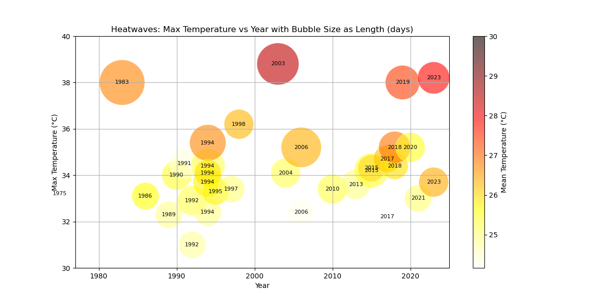

Fig. 1: Bubble plot of heatwaves 92nd percentile method for the period 1970-2024.

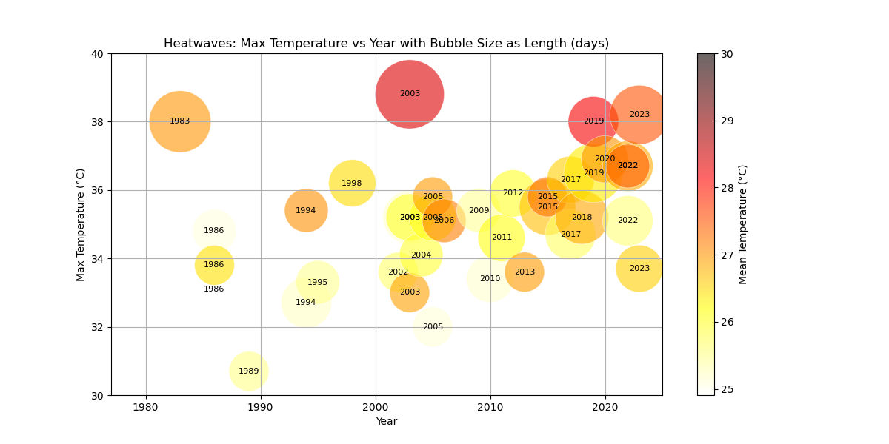

Fig. 2: Bubble plot of heatwaves EHF percentile method for the period 1970-2024.

The bubble plots in Figures 1 and 2 visualize the heatwaves detected using the 92nd percentile method and the Excess Heat Factor (EHF) method, respectively, over the period from 1970 to 2024. Both plots display the maximum temperature (Tmax) on the y-axis and the year on the x-axis, with bubble size indicating the length of the heatwave in days and color representing the mean temperature during the heatwave.

Figure 1 shows the results of the 92nd percentile method, which detected a total of 33 heatwaves. Major events such as those in 2003, 2019, and 2023 stand out with large bubbles and high Tmax values. The plot indicates an increase in the frequency and intensity of heatwaves in recent decades, suggesting a trend towards more extreme heat events. This method provides a straightforward approach to heatwave detection, making it easy to implement and understand. However, it may miss some heatwaves if temperatures slightly dip below the threshold.

Figure 2 presents the results of the EHF method, which identified 41 heatwaves, highlighting its higher sensitivity compared to the 92nd percentile method. All significant heatwaves detected by the 92nd percentile method were also captured by the EHF method. Additionally, the EHF method identified extra events, particularly in recent years, underscoring the thrend in terms of total heat load.

The subtle differences in both detection methods can be attributed to several factors, one of which is a shift in the temperature distribution, affecting both the median and variability, especially at the extremes. These shifts are crucial when studying heatwaves. Clear differences are observed in particular years where one method might not detect heatwaves while the other does. For instance, the summer of 2022 was the hottest summer recorded in France, yet no heatwaves were detected using the 92nd percentile method. In contrast, the EHF methodology identified three heatwaves during the same period.

To understand these differences better, the next section examines specific examples in detail.

### Examples of Heatwave Detection Discrepancies

To understand the differences between the 92nd percentile and EHF methods in detecting heatwaves, we examine specific examples from various years. The figures below illustrate temperature trends and EHF values for the summers of 1994, 2003, 2006, 2018, 2019, 2022, and 2023. In these plots, the red and blue horizontal lines represent the 92nd percentile thresholds for Tmax and Tmin, respectively, used in the 92nd percentile method. The green line shows the EHF values used in the EHF method. Both methods filter heatwaves for periods lasting at least three days over their respective thresholds. The total Heat Load of an event can be then understood as the area under the EHF curve over a certain p-threshold, in this case 0.85.

#### Summer 1994

In 1994, the 92nd percentile method detects five heatwave periods: July 1-4, July 12-14, July 25-30, August 3-9, and August 21-23. The EHF method identifies heatwaves from June 28-July 5 and August 1-6. Both methods agree on the significant heat events in late July and early August, but the EHF method also detects a heatwave in late June to early July not identified by the 92nd percentile method.

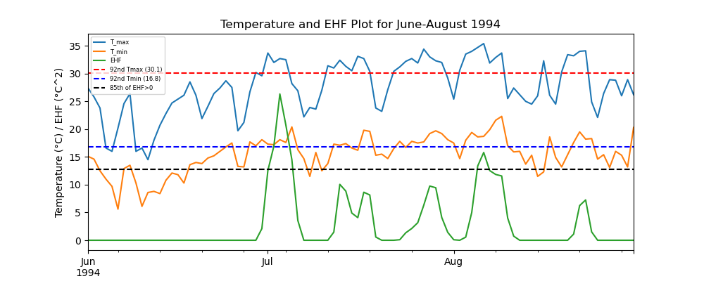

Fig. 3: Heat wave episodes of summer of 1994. 

#### Summer 2003

In 2003, the 92nd percentile method detects a heatwave from August 5-14. The EHF method identifies this period as well but also detects additional heatwaves from June 8-16, June 20-26, and July 11-15. Both methods identify the major heatwave in August, but the EHF method captures additional periods of heat stress in June and July.

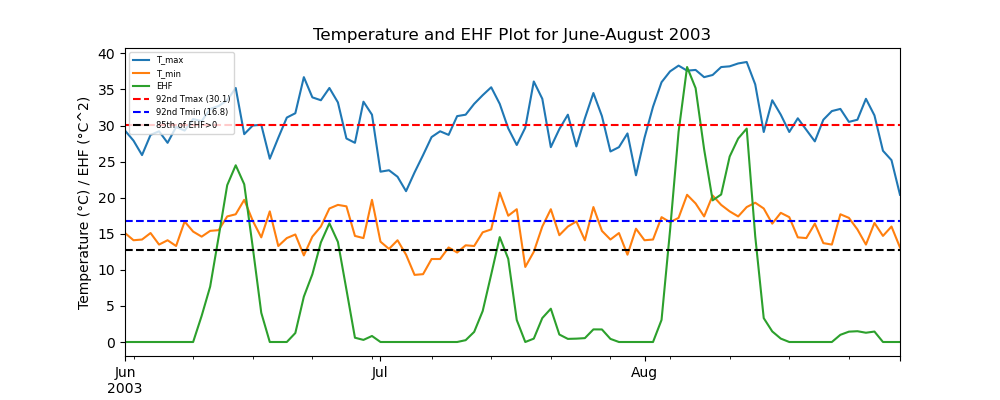

Fig. 4: Heat wave episodes of summer of 2003.

#### Summer 2006

In 2006, the 92nd percentile method detects heatwaves from July 11-13 and July 19-27. The EHF method detects a heatwave from July 22-27, overlapping with the latter period detected by the 92nd percentile method. The EHF method identifies the same significant heat period in late July but does not identify the shorter heatwave in mid-July.

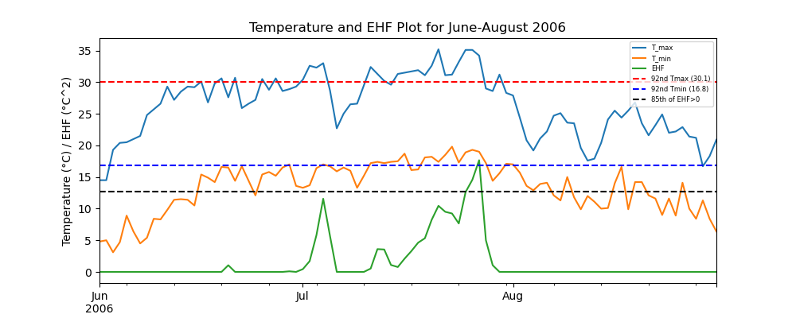

Fig. 5: Heat wave episodes of summer of 2006.

#### Summer 2018

In 2018, the 92nd percentile method detects heatwaves from July 31-August 2 and August 4-8. The EHF method identifies a continuous heatwave from July 31 to August 8, covering both periods identified by the 92nd percentile method and indicating a longer duration of heat stress.

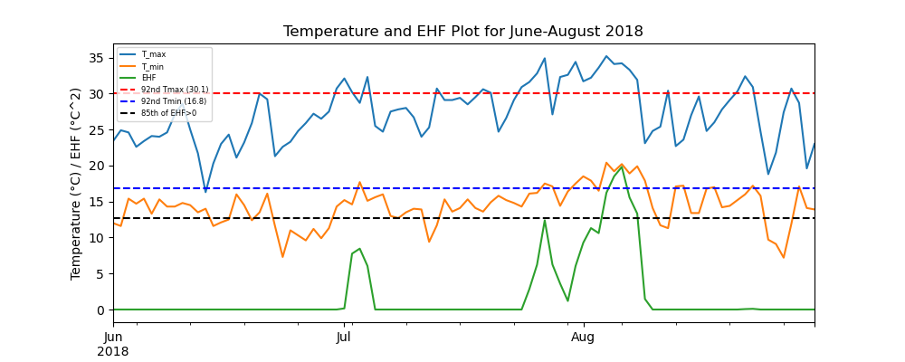

Fig. 6: Heat wave episodes of summer of 2018.

#### Summer 2019

In 2019, the 92nd percentile method detects a heatwave from July 21-26. The EHF method identifies this period as well but also detects an earlier heatwave from June 22 to July 2. Both methods agree on the late July heatwave, but the EHF method additionally identifies a significant heat period in late June to early July.

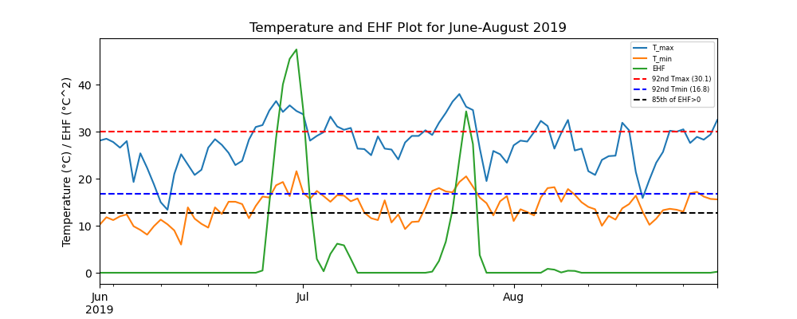

Fig. 7: Heat wave episodes of summer of 2019.

#### Summer 2022

In 2022, the 92nd percentile method does not detect any heatwaves. In contrast, the EHF method identifies three heatwaves: June 14-21, July 15-22, and July 31-August 5. The EHF method detects significant heat stress periods that the 92nd percentile method misses, indicating differences in sensitivity. This significant difference highlights the 92nd percentile method's limitations in capturing periods of sustained heat stress, which the EHF method can quantify through its cumulative heat load assessment.

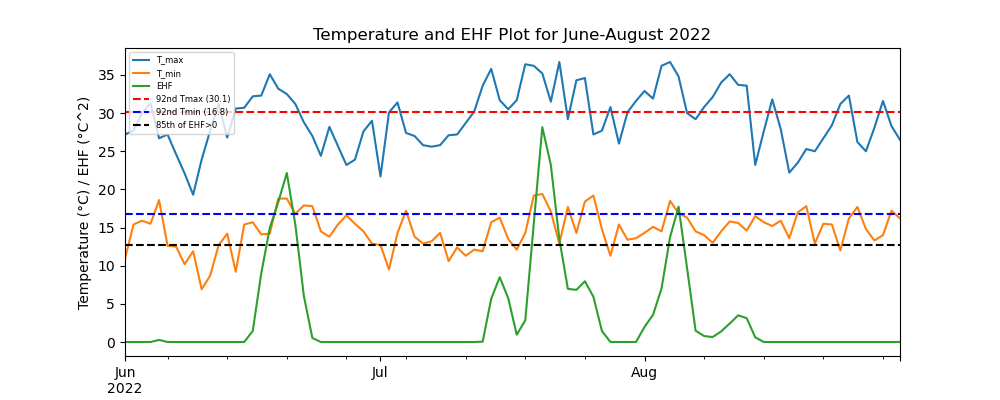

Fig. 8: Heat wave episodes of summer of 2022.

#### Summer 2023

In 2023, the 92nd percentile method detects heatwaves from July 8-11 and August 21-25. The EHF method identifies these periods and additional heat stress from July 5-11 and August 15-25. Both methods detect the late August heatwave, but the EHF method captures more extended periods of heat stress.

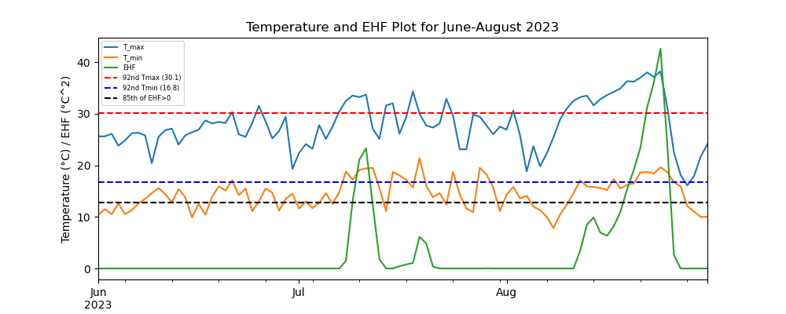

Fig. 9: Heat wave episodes of summer of 2023.

These examples highlight the key differences in heatwave detection between the 92nd percentile and EHF methods. The 92nd percentile method relies on fixed temperature thresholds, which may miss heatwaves when temperatures temporarily dip below the threshold. The EHF method, by considering cumulative heat stress, captures additional heatwave periods that reflect prolonged exposure to high temperatures.

## Application of EHF on Heat Wave Return Period Calculation

### Application of EHF on Heat Wave Return Period Calculation

To calculate the heat wave return period for future scenarios, we used climate projections from SSP2 and SSP5 along with the historical reference period (1970-2014) for validation. All these datasets were downscaled using the MAR model (Modèle Atmosphérique Régionale)【Gallee et Sayhes, 1992; https://www.ige-grenoble.fr/Modeles-numeriques-1086】.

#### Methodology

1. **Heatwave Definition**: We defined heatwaves using the Excess Heat Factor (EHF) methodology, similar to the historical validation. We applied this definition to the MAR-HIST data to establish a baseline.
2. **Threshold Calculation**: The temperature values corresponding to the 85th percentile were determined, and these thresholds were used to identify heatwaves in future projections.
3. **Heatwave Detection**: We identified heatwaves in the SSP2 and SSP5 scenarios based on the calculated thresholds.
4. **Return Period Calculation**: Using the identified heatwaves, we calculated the return period for each period 30 years. The periods applied are the same than the ones in the thesis of Francisco.

| Forcing | Scenario | Period     | Short Name    |
|---------|----------|------------|---------------|
| Measured| -        | 1985-2014  | MAR-ERA5      |
| MPI     | HIST     | 1985-2014  | MAR-MPI-HIST  |
|         | SSP5     | 2016-2045  | MAR-MPI-530   |
|         |          | 2036-2065  | MAR-MPI-550   |
|         |          | 2066-2085  | MAR-MPI-570   |
|         | SSP2     | 2016-2045  | MAR-MPI-230   |
|         |          | 2036-2065  | MAR-MPI-250   |
|         |          | 2066-2085  | MAR-MPI-270   |

#### Results Visualization

Below are the bubble plots for the measured and future scenarios:

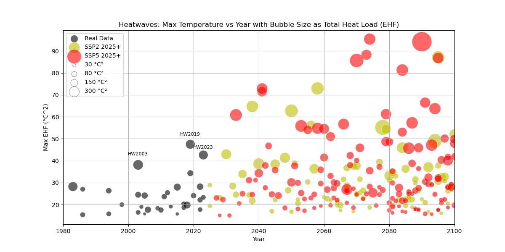

Figure 10: Heatwaves: Total Heat Load vs Year. Shows historical (gray) and projected (yellow for SSP2, red for SSP5) heatwaves based on total heat load (EHF). Bubble size represents maximum EHF. Notable historical heatwaves (HW2003, HW2019, HW2023) are labeled.

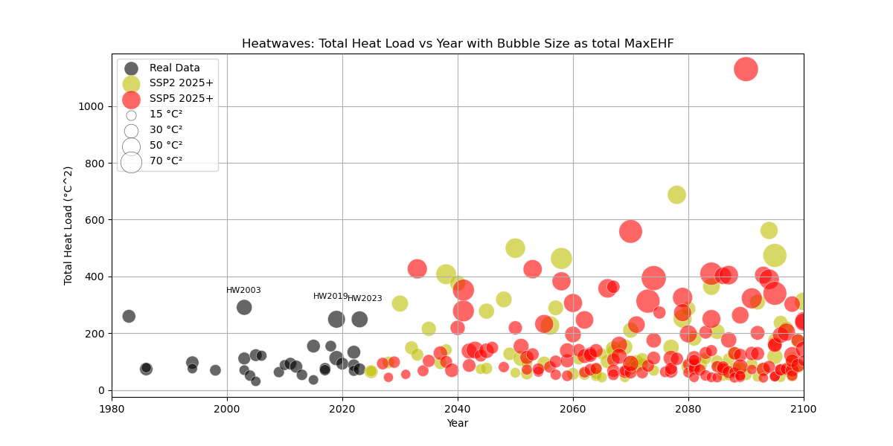

Figure 11: Heatwaves: Max Temperature vs Year. Displays historical (gray) and projected (yellow for SSP2, red for SSP5) heatwaves based on maximum temperature. Bubble size represents total heat load (EHF). Notable historical heatwaves (HW2003, HW2019, HW2023) are labeled.

Figure 10 depicts the progression of heatwaves from historical data to future projections using the SSP2 and SSP5 scenarios. The heatwaves are characterized by their total heat load (EHF) with the bubble size representing the intensity. The historical data (in gray) shows relatively lower heat loads compared to the future projections. Notably, significant heatwaves like HW2003, HW2019, and HW2023 are highlighted. The future projections indicate a marked increase in the frequency and intensity of heatwaves, especially under the SSP5 scenario, which shows more intense and frequent heat events compared to SSP2.

Figure 11 illustrates the same progression but with the bubble size representing the maximum EHF during the heatwave. Here, the historical data also show less intense heatwaves compared to future projections. Similar to the first figure, HW2003, HW2019, and HW2023 are identified, showing their relative intensities. The future scenarios, particularly SSP5, demonstrate a dramatic increase in both the frequency and intensity of heatwaves, highlighting the increasing severity of heat events as projected into the future.

### Return Period Calculation

Based on the analysis of historical data and climate projections, we can calculate the return period of the significant heatwave that occurred in 2023. This event, which took place from August 15th to August 25th, had a MaxEHF of 43.74 °C² and a Total Heat Load of 198.57 °C². Using the MAR model projections for SSP2 and SSP5 scenarios, we determined the return periods for both MaxEHF and Heat Load across different time periods. The data provided insights into how frequently such extreme events might occur in the future under varying climate scenarios.

For the 2023 heatwave, the return periods are calculated as follows:

| data     | Period    |   MaxEHF Return Period |   HeatLoad Return Period |
|:---------|:----------|-----------------------:|-------------------------:|
| Measured | 1971-2000 |                  nan   |                    nan   |
| Measured | 1986-2015 |                  nan   |                     30   |
| Measured | 2001-2030 |                   15   |                     10   |
| MAR-HIST | 1971-2000 |                   30   |                     30   |
| MAR-HIST | 1986-2015 |                   15   |                     30   |
| MAR-SSP2 | 2016-2045 |                   15   |                      6   |
| MAR-SSP2 | 2036-2065 |                    7.5 |                      3.8 |
| MAR-SSP2 | 2066-2085 |                    6.7 |                      3.3 |
| MAR-SSP5 | 2016-2045 |                    7.5 |                      6   |
| MAR-SSP5 | 2036-2065 |                    3.8 |                      3.3 |
| MAR-SSP5 | 2066-2085 |                    2   |                      1.7 |

These return periods provide an estimate of how often similar heatwave events might occur in the future.

## Conclusion

## Conclusions

While both methods are designed for detecting summer heatwaves, particularly those associated with impacts on human health, the Excess Heat Factor (EHF) offers a more refined approach. By considering both immediate and cumulative heat stress, the EHF metric provides a comprehensive assessment of heatwave severity. 

The 92nd percentile method relies solely on threshold exceedance of maximum and minimum temperatures, which can miss significant heat events that build gradually. In contrast, the EHF method takes into account the anomaly relative to the local climate, providing a better indication of human discomfort and health risks.

Moreover, our analysis of historical data and future climate projections using the MAR model shows further application of the EHF metric. The significant heatwave of 2023, characterized by a MaxEHF of 43.74 °C² and a Total Heat Load of 198.57 °C², demonstrates the utility of the EHF in assessing heatwave severity and calculating return periods. The projections indicate that such extreme events will become more frequent under future climate scenarios (SSP2 and SSP5).

In conclusion, the EHF represents a useful metric in the detection and analysis of heatwaves. This method not only proves useful in heatwave detection but also enhances our understanding of a heatwave event and characterise it termporarily and spatially.

## Annex

|    |   year | method   | start_date          | end_date            |   Duration |   MaxEHF |   HeatLoad |
|---:|-------:|:---------|:--------------------|:--------------------|-----------:|---------:|-----------:|
|  0 |   1975 | 92nd     | 1975-08-02 00:00:00 | 1975-08-05 00:00:00 |          4 | nan      |   nan      |
|  1 |   1983 | 92nd     | 1983-07-20 00:00:00 | 1983-07-31 00:00:00 |         12 | nan      |   nan      |
|  2 |   1983 | ehf      | 1983-07-16 00:00:00 | 1983-07-20 00:00:00 |          3 |  14.7079 |    14.7079 |
|  3 |   1983 | ehf      | 1983-07-18 00:00:00 | 1983-07-29 00:00:00 |         10 |  29.171  |   183.967  |
|  4 |   1986 | 92nd     | 1986-06-27 00:00:00 | 1986-06-29 00:00:00 |          3 | nan      |   nan      |
|  5 |   1986 | ehf      | 1986-06-24 00:00:00 | 1986-06-30 00:00:00 |          5 |  28.6017 |    69.2161 |
|  6 |   1986 | ehf      | 1986-07-26 00:00:00 | 1986-07-31 00:00:00 |          4 |  16.3193 |    30.8506 |
|  7 |   1986 | ehf      | 1986-07-30 00:00:00 | 1986-08-03 00:00:00 |          3 |  15.0544 |    15.0544 |
|  8 |   1989 | 92nd     | 1989-07-22 00:00:00 | 1989-07-24 00:00:00 |          3 | nan      |   nan      |
|  9 |   1989 | ehf      | 1989-07-19 00:00:00 | 1989-07-23 00:00:00 |          3 |  15.7772 |    15.7772 |
| 10 |   1990 | 92nd     | 1990-08-02 00:00:00 | 1990-08-05 00:00:00 |          4 | nan      |   nan      |
| 11 |   1991 | 92nd     | 1991-08-24 00:00:00 | 1991-08-27 00:00:00 |          4 | nan      |   nan      |
| 12 |   1992 | 92nd     | 1992-07-29 00:00:00 | 1992-07-31 00:00:00 |          3 | nan      |   nan      |
| 13 |   1992 | 92nd     | 1992-08-06 00:00:00 | 1992-08-09 00:00:00 |          4 | nan      |   nan      |
| 14 |   1992 | ehf      | 1992-08-04 00:00:00 | 1992-08-08 00:00:00 |          3 |  13.9678 |    13.9678 |
| 15 |   1994 | 92nd     | 1994-07-01 00:00:00 | 1994-07-04 00:00:00 |          4 | nan      |   nan      |
| 16 |   1994 | 92nd     | 1994-07-12 00:00:00 | 1994-07-14 00:00:00 |          3 | nan      |   nan      |
| 17 |   1994 | 92nd     | 1994-07-25 00:00:00 | 1994-07-30 00:00:00 |          6 | nan      |   nan      |
| 18 |   1994 | 92nd     | 1994-08-03 00:00:00 | 1994-08-09 00:00:00 |          7 | nan      |   nan      |
| 19 |   1994 | 92nd     | 1994-08-21 00:00:00 | 1994-08-23 00:00:00 |          3 | nan      |   nan      |
| 20 |   1994 | ehf      | 1994-06-28 00:00:00 | 1994-07-05 00:00:00 |          6 |  27.6376 |    83.2843 |
| 21 |   1994 | ehf      | 1994-08-01 00:00:00 | 1994-08-06 00:00:00 |          4 |  16.4266 |    30.3735 |
| 22 |   1995 | 92nd     | 1995-07-20 00:00:00 | 1995-07-22 00:00:00 |          3 | nan      |   nan      |
| 23 |   1995 | ehf      | 1995-07-17 00:00:00 | 1995-07-22 00:00:00 |          4 |  15.5336 |    29.882  |
| 24 |   1997 | 92nd     | 1997-08-08 00:00:00 | 1997-08-10 00:00:00 |          3 | nan      |   nan      |
| 25 |   1998 | 92nd     | 1998-08-09 00:00:00 | 1998-08-12 00:00:00 |          4 | nan      |   nan      |
| 26 |   1998 | ehf      | 1998-08-06 00:00:00 | 1998-08-12 00:00:00 |          5 |  20.9109 |    58.1433 |
| 27 |   2002 | ehf      | 2002-06-19 00:00:00 | 2002-06-23 00:00:00 |          3 |  15.3372 |    15.3372 |
| 28 |   2003 | 92nd     | 2003-08-05 00:00:00 | 2003-08-14 00:00:00 |         10 | nan      |   nan      |
| 29 |   2003 | ehf      | 2003-06-08 00:00:00 | 2003-06-16 00:00:00 |          7 |  25.849  |   102.097  |
| 30 |   2003 | ehf      | 2003-06-20 00:00:00 | 2003-06-26 00:00:00 |          5 |  17.2454 |    46.3905 |
| 31 |   2003 | ehf      | 2003-07-11 00:00:00 | 2003-07-15 00:00:00 |          3 |  15.1763 |    15.1763 |
| 32 |   2003 | ehf      | 2003-07-31 00:00:00 | 2003-08-14 00:00:00 |         13 |  39.1164 |   291.101  |
| 33 |   2004 | 92nd     | 2004-07-20 00:00:00 | 2004-07-23 00:00:00 |          4 | nan      |   nan      |
| 34 |   2004 | ehf      | 2004-07-18 00:00:00 | 2004-07-23 00:00:00 |          4 |  20.0664 |    35.1392 |
| 35 |   2004 | ehf      | 2004-07-29 00:00:00 | 2004-08-02 00:00:00 |          3 |  14.6695 |    14.6695 |
| 36 |   2005 | ehf      | 2005-06-20 00:00:00 | 2005-06-24 00:00:00 |          3 |  15.6333 |    15.6333 |
| 37 |   2005 | ehf      | 2005-06-22 00:00:00 | 2005-06-28 00:00:00 |          5 |  25.3418 |    55.0618 |
| 38 |   2005 | ehf      | 2005-07-13 00:00:00 | 2005-07-17 00:00:00 |          3 |  16.6129 |    16.6129 |
| 39 |   2006 | 92nd     | 2006-07-11 00:00:00 | 2006-07-13 00:00:00 |          3 | nan      |   nan      |
| 40 |   2006 | 92nd     | 2006-07-19 00:00:00 | 2006-07-27 00:00:00 |          9 | nan      |   nan      |
| 41 |   2006 | ehf      | 2006-07-22 00:00:00 | 2006-07-27 00:00:00 |          4 |  18.304  |    33.4606 |
| 42 |   2009 | ehf      | 2009-08-16 00:00:00 | 2009-08-21 00:00:00 |          4 |  19.1805 |    34.3944 |
| 43 |   2010 | 92nd     | 2010-07-09 00:00:00 | 2010-07-12 00:00:00 |          4 | nan      |   nan      |
| 44 |   2010 | ehf      | 2010-07-06 00:00:00 | 2010-07-12 00:00:00 |          5 |  18.6153 |    49.0798 |
| 45 |   2011 | ehf      | 2011-08-17 00:00:00 | 2011-08-23 00:00:00 |          5 |  24.8284 |    63.7143 |
| 46 |   2012 | ehf      | 2012-08-16 00:00:00 | 2012-08-22 00:00:00 |          5 |  26.4395 |    65.5631 |
| 47 |   2013 | 92nd     | 2013-07-25 00:00:00 | 2013-07-28 00:00:00 |          4 | nan      |   nan      |
| 48 |   2013 | ehf      | 2013-07-23 00:00:00 | 2013-07-27 00:00:00 |          3 |  20.1503 |    20.1503 |
| 49 |   2015 | 92nd     | 2015-07-02 00:00:00 | 2015-07-04 00:00:00 |          3 | nan      |   nan      |
| 50 |   2015 | 92nd     | 2015-07-17 00:00:00 | 2015-07-22 00:00:00 |          6 | nan      |   nan      |
| 51 |   2015 | ehf      | 2015-06-28 00:00:00 | 2015-07-07 00:00:00 |          8 |  29.0884 |   144.873  |
| 52 |   2015 | ehf      | 2015-08-03 00:00:00 | 2015-08-07 00:00:00 |          3 |  16.3942 |    16.3942 |
| 53 |   2017 | 92nd     | 2017-06-21 00:00:00 | 2017-06-23 00:00:00 |          3 | nan      |   nan      |
| 54 |   2017 | 92nd     | 2017-08-27 00:00:00 | 2017-08-29 00:00:00 |          3 | nan      |   nan      |
| 55 |   2017 | ehf      | 2017-06-17 00:00:00 | 2017-06-24 00:00:00 |          6 |  21.3138 |    69.5487 |
| 56 |   2017 | ehf      | 2017-07-29 00:00:00 | 2017-08-04 00:00:00 |          5 |  19.4354 |    51.2333 |
| 57 |   2018 | 92nd     | 2018-07-31 00:00:00 | 2018-08-02 00:00:00 |          3 | nan      |   nan      |
| 58 |   2018 | 92nd     | 2018-08-04 00:00:00 | 2018-08-08 00:00:00 |          5 | nan      |   nan      |
| 59 |   2018 | ehf      | 2018-07-31 00:00:00 | 2018-08-08 00:00:00 |          7 |  20.57   |    86.8498 |
| 60 |   2019 | 92nd     | 2019-07-21 00:00:00 | 2019-07-26 00:00:00 |          6 | nan      |   nan      |
| 61 |   2019 | ehf      | 2019-06-22 00:00:00 | 2019-07-02 00:00:00 |          9 |  49.0573 |   236.166  |
| 62 |   2019 | ehf      | 2019-07-19 00:00:00 | 2019-07-26 00:00:00 |          6 |  35.2702 |   102.451  |
| 63 |   2020 | 92nd     | 2020-08-10 00:00:00 | 2020-08-13 00:00:00 |          4 | nan      |   nan      |
| 64 |   2020 | ehf      | 2020-07-26 00:00:00 | 2020-08-01 00:00:00 |          5 |  25.0221 |    62.2059 |
| 65 |   2020 | ehf      | 2020-08-07 00:00:00 | 2020-08-11 00:00:00 |          3 |  14.8491 |    14.8491 |
| 66 |   2021 | 92nd     | 2021-08-13 00:00:00 | 2021-08-15 00:00:00 |          3 | nan      |   nan      |
| 67 |   2022 | ehf      | 2022-06-14 00:00:00 | 2022-06-21 00:00:00 |          6 |  23.2314 |    74.9001 |
| 68 |   2022 | ehf      | 2022-07-15 00:00:00 | 2022-07-22 00:00:00 |          6 |  29.1238 |    83.6501 |
| 69 |   2022 | ehf      | 2022-07-31 00:00:00 | 2022-08-05 00:00:00 |          4 |  18.388  |    32.6908 |
| 70 |   2023 | 92nd     | 2023-07-08 00:00:00 | 2023-07-11 00:00:00 |          4 | nan      |   nan      |
| 71 |   2023 | 92nd     | 2023-08-21 00:00:00 | 2023-08-25 00:00:00 |          5 | nan      |   nan      |
| 72 |   2023 | ehf      | 2023-07-05 00:00:00 | 2023-07-11 00:00:00 |          5 |  24.3196 |    60.3195 |
| 73 |   2023 | ehf      | 2023-08-15 00:00:00 | 2023-08-25 00:00:00 |          9 |  43.7445 |   198.567  |

Table A1. Heat waves detected with both EHF and 92nd methods.

## References

- Perkins, S. E., Alexander, L. V., & Nairn, J. R. (2013). Increasing frequency, intensity and duration of observed global heatwaves and warm spells. *Nature Climate Change*, 2(1), 3-6.
- Perkins, S. E. (2015). A review on the scientific understanding of heatwaves—Their measurement, driving mechanisms, and changes at the global scale. *Atmospheric Research*, 164, 242-267.
- Pezza, A. B., van Rensch, P., & Cai, W. (2012). Severe heat waves in southern Australia: Synoptic climatology and large scale connections. *Climate Dynamics*, 38(1-2), 209-224.
- Pascal, M., et al. (2006). Heat waves: Increases in mortality in Europe. *Nature*, 432(7017), 610-613.
- Nairn, J. R., & Fawcett, R. J. (2016). The excess heat factor as a metric for heat-related fatalities: Defining heatwave risk categories. *Australian Journal of Emergency Management*, 31(4), 22-27.
- Nairn J & Fawcett R 2015, The Excess Heat Factor: A metric for heatwave intensity and its use in classifying heatwave severity. *International Journal of Environmental Research and Public Health*, 12, pp. 227-253.

---

[def]: hw_bubble_92nd.png
