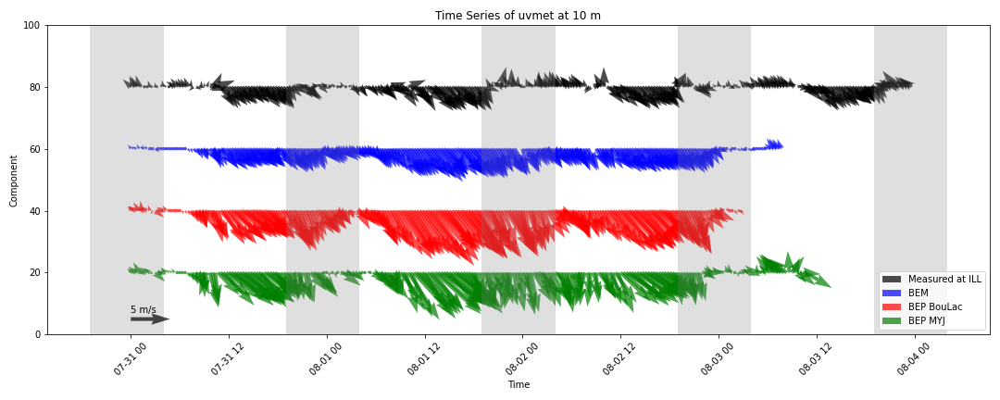
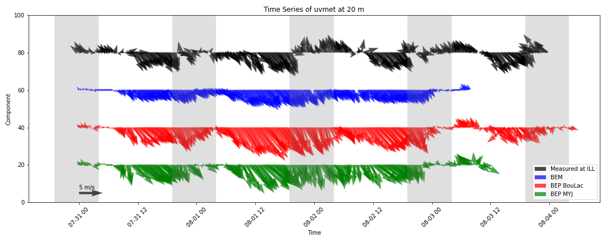
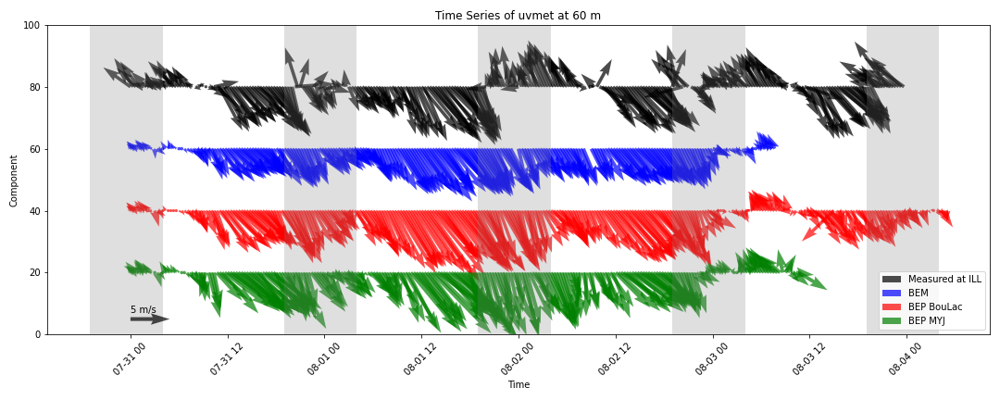
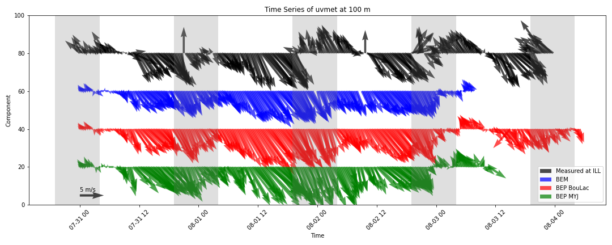

# Wind Component Analysis

This document provides a visual and statistical analysis of wind components at different heights.

## Time Series of Wind Components

The following figures show the time series of the u and v components of the wind at different heights, measured at the ILL site and modeled by different methods.

### 10m Height

### 20m Height

### 60m Height

### 100m Height

## Mean Absolute Error (MAE) Table

The MAE table provides a comparison of the absolute error between the measured and modeled u and v components of the wind.

| Height (m)     | 10     | 10     | 20     | 20     | 60     | 60     | 100    | 100    |
|----------------|--------|--------|--------|--------|--------|--------|--------|--------|
| Variable (m/s) | u      | v      | u      | v      | u      | v      | u      | v      |
| BEP MYJ        | 1.442  | 2.421  | 1.394  | 2.289  | 1.804  | 3.171  | 1.994  | 3.295  |
| BEP BouLac     | 1.610  | 3.051  | 1.468  | 2.701  | 1.773  | 3.196  | 1.855  | 3.222  |
| BEM            | 0.957  | 1.710  | 1.167  | 1.910  | 1.642  | 2.835  | 1.778  | 2.943  |

## Averaged Normalized Dot Product Table

The Averaged Normalized Dot Product table indicates the similarity between the measured and modeled wind components, normalized over the period.

| Height | 10    | 20    | 60    | 100   |
|--------|-------|-------|-------|-------|
| BEP MYJ| 0.320 | 0.318 | 0.374 | 0.373 |
| BEP BouLac | 0.337 | 0.363 | 0.380 | 0.378 |
| BEM    | 0.343 | 0.358 | 0.378 | 0.376 |
